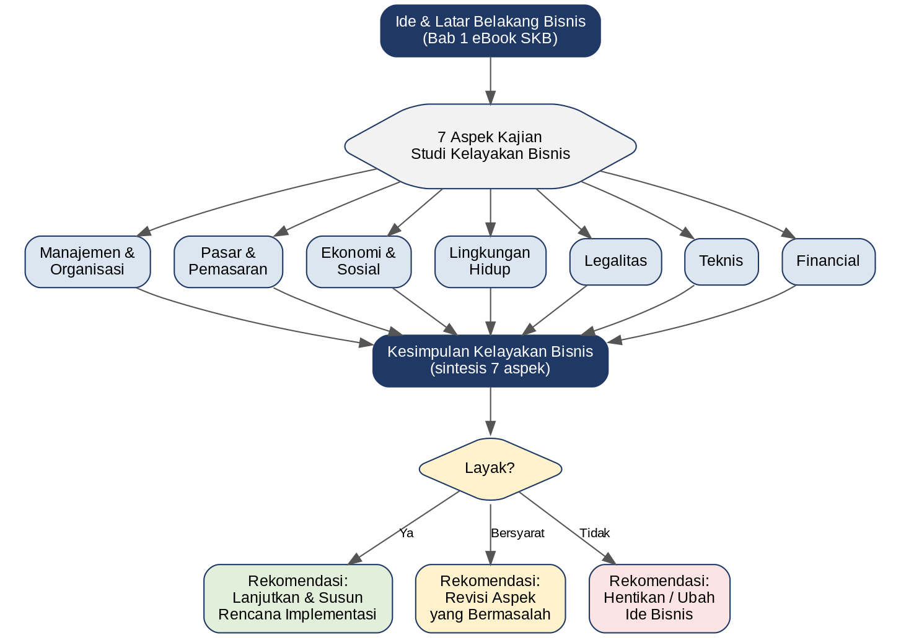
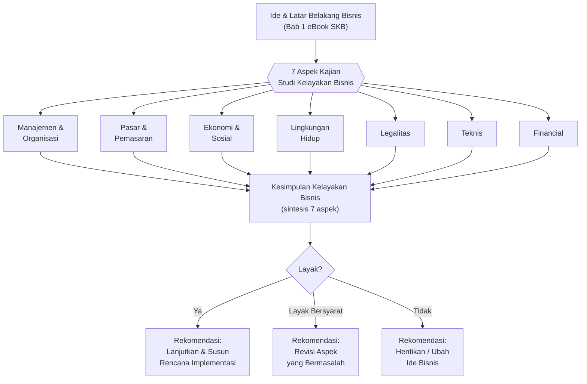

# Peta Konsep — Studi Kelayakan Bisnis

## Sumber Diagram (Mermaid)

```mermaid
flowchart TD
    A["Ide & Latar Belakang Bisnis<br/>(Bab 1 eBook SKB)"] --> B{{"7 Aspek Kajian<br/>Studi Kelayakan Bisnis"}}

    B --> C1["Manajemen &<br/>Organisasi"]
    B --> C2["Pasar &<br/>Pemasaran"]
    B --> C3["Ekonomi &<br/>Sosial"]
    B --> C4["Lingkungan<br/>Hidup"]
    B --> C5["Legalitas"]
    B --> C6["Teknis"]
    B --> C7["Financial"]

    C1 --> D["Kesimpulan Kelayakan Bisnis<br/>(sintesis 7 aspek)"]
    C2 --> D
    C3 --> D
    C4 --> D
    C5 --> D
    C6 --> D
    C7 --> D

    D --> E{"Layak?"}
    E -->|Ya| F["Rekomendasi:<br/>Lanjutkan & Susun<br/>Rencana Implementasi"]
    E -->|Layak Bersyarat| G["Rekomendasi:<br/>Revisi Aspek<br/>yang Bermasalah"]
    E -->|Tidak| H["Rekomendasi:<br/>Hentikan / Ubah<br/>Ide Bisnis"]
```
